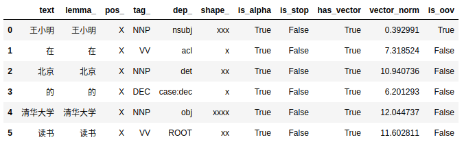
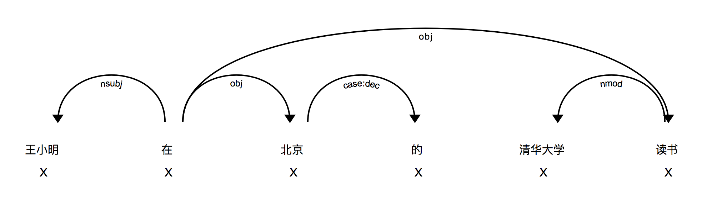

[中文版本的 README](README.zh-Hans.md)
------------------------------

# Chinese models for SpaCy

SpaCy (version > 2) models for Chinese language. Those models are rough and still **working in prograss**. But "Something is Better Than Nothing".

## Online demo

An online jupyter notebook / demo is provided at [](https://mybinder.org/v2/gh/howl-anderson/Chinese_models_for_SpaCy/master?filepath=notebooks%2Fdemo.ipynb).

### Features

Partial attributes of a `Doc` object for `王小明在北京的清华大学读书`:



### NER (**New!**)
NER of a `Doc` object for `王小明在北京的清华大学读书`:


## Getting Started

Models are released as binary file, users should know basic knowledge of using SpaCy version 2+.

### Prerequisites

Python 3 (maybe python2, but currently not well tested)

### Installing

Download relased model from `releases`.

```
wget -c https://github.com/howl-anderson/Chinese_models_for_SpaCy/releases/download/v2.0.4/zh_core_web_sm-2.0.4.tar.gz
```

then install model

```
pip install zh_core_web_sm-2.0.4.tar.gz
```


## Running demo code

`test.py` contains demo codes. After install the model, user can download or clone this repo then execute:

```bash
python3 ./test.py
```

then, open web browser to `http://127.0.0.1:5000`, user will see image simllar to this:



## How to re-produce model

See [workflow](workflow.md)

## Corpus Data
The corpus data used in this project is OntoNotes 5.0。

Since OntoNotes 5.0 is copyright material of LDC ([Linguistic Data Consortium](https://www.ldc.upenn.edu/)) . This project can not include the daa directly。Good news is OntoNotes 5.0 is free to organizer user, you can set up a count for your company or school, then you can get the OntoNotes 5.0 at no cost。


## TODO list

* Attribute `pos_` is not working correctly. This related to Language class in SpaCy.
* Attribute `shape_` and `is_alpha` seems meaningless for Chinese, need make sure of it.
* Attribute `is_stop` is not working correctly. This related to Language class in SpaCy.
* Attribute `vector` seems not well trained
* <s>Attribute `is_oov` is totally incorrect. First priority.</s>
* <s>NER model is not available due to lacking of LDC corpus. I am working on it.</s>
* Release all the intermediate material to help user build own model

## Built With

* TODO

## Contributing

Please read [CONTRIBUTING.md](https://gist.github.com/PurpleBooth/b24679402957c63ec426) for details on our code of conduct, and the process for submitting pull requests to us.

## Versioning

We use [SemVer](http://semver.org/) for versioning. For the versions available, see the `tags` on this repository.

## Authors

* **Xiaoquan Kong** - *Initial work* - [howl-anderson](https://github.com/howl-anderson)

See also the list of `contributors` who participated in this project.

## License

This project is licensed under the MIT License - see the [LICENSE.md](LICENSE.md) file for details

## Acknowledgments

* TODO
